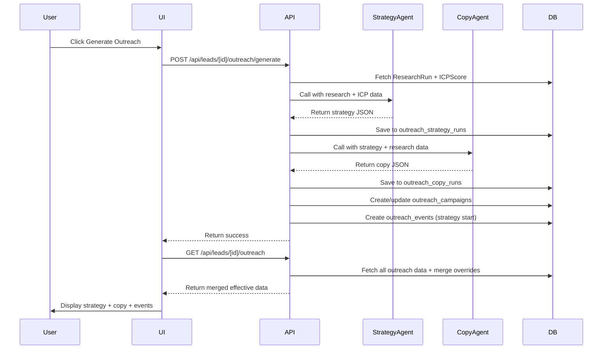
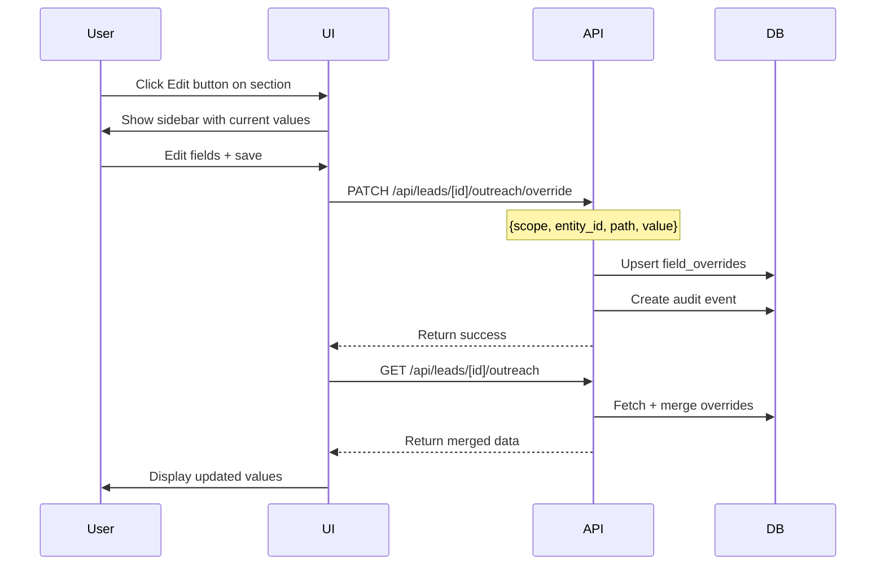

# Outreach Campaign Page - Data Mapping & Schema Requirements

## UI Field Inventory & Data Source Classification

### 1. Header / Lead Selector

| Field           | Source                              | Type | Notes    |
| --------------- | ----------------------------------- | ---- | -------- |
| `lead.id`       | Lead collection                     | DB   | Existing |
| `lead.name`     | Lead collection                     | DB   | Existing |
| `lead.company`  | Company collection (via company_id) | DB   | Existing |
| `lead.icpScore` | ICPScore collection                 | DB   | Existing |
| `lead.stage`    | Lead collection                     | DB   | Existing |

### 2. Outreach Summary Strip (5 columns)

| Field               | Source                                   | Type      | Notes                                       |
| ------------------- | ---------------------------------------- | --------- | ------------------------------------------- |
| Outreach Status     | `outreach_campaigns.status`              | AI/System | active/paused/stopped/completed/not_started |
| Current Phase       | `outreach_campaigns.current_phase`       | AI/System | Research/Engagement/Qualification/Handoff   |
| Last Action         | Computed from latest `outreach_events`   | Computed  | `events[0].title + timestamp`               |
| Next Planned Action | `outreach_campaigns.next_planned_action` | AI/Manual | {label, scheduled_at}                       |
| Final AI Decision   | `outreach_campaigns.final_decision`      | AI/System | {status, reason}                            |

### 3. AI-Generated Outreach Strategy Card

| Field           | Source                                                                       | Type   | Notes                          |
| --------------- | ---------------------------------------------------------------------------- | ------ | ------------------------------ |
| Strategy Status | `outreach_strategy_runs.strategy_output.strategy_status`                     | AI     | READY/NO_OUTREACH/NEEDS_REVIEW |
| Total Steps     | `outreach_strategy_runs.strategy_output.recommended_channel_sequence.length` | AI     | Computed from steps array      |
| Current Step    | `outreach_campaigns.current_step_number`                                     | System | Updated as campaign progresses |
| Steps Array     | `outreach_strategy_runs.strategy_output.recommended_channel_sequence`        | AI     | See step schema below          |

#### Step Schema (per channel/step)

| Field                   | Source        | Type     | Notes                                                |
| ----------------------- | ------------- | -------- | ---------------------------------------------------- |
| step_number             | AI            | number   | From strategy agent                                  |
| channel                 | AI            | string   | Email/LinkedIn/Voice                                 |
| status                  | System/Manual | string   | completed/active/pending (tracked in campaign state) |
| goal                    | AI (editable) | string   | Short description of step goal                       |
| intent                  | AI            | string   | From strategy agent                                  |
| reasoning               | AI (editable) | string   | Why this step exists                                 |
| recommended_delay       | AI (editable) | string   | e.g., "2 days", "48 hours"                           |
| send_window             | AI (editable) | string   | Optional: "Business hours only"                      |
| personalization_signals | AI            | string[] | From strategy agent                                  |
| gating_conditions       | AI (editable) | string[] | Voice readiness checks                               |

### 4. Voice Readiness Block

| Field                   | Source                   | Type     | Notes                         |
| ----------------------- | ------------------------ | -------- | ----------------------------- |
| icp_threshold_met       | Computed from ICP score  | Computed | ICP >= 80                     |
| engagement_signals_met  | Computed from events     | Computed | 2+ channels engaged           |
| guardrails_passed       | Computed from guardrails | Computed | All voice guardrails pass     |
| human_approval_required | AI (from strategy)       | boolean  | From voice_readiness object   |
| why_voice (rationale)   | AI (editable)            | string   | From strategy voice_readiness |

### 5. Conversation & Activity History (Audit Log)

| Field                         | Source                                   | Type            | Notes                                                             |
| ----------------------------- | ---------------------------------------- | --------------- | ----------------------------------------------------------------- |
| event.id                      | `outreach_events._id`                    | DB              | MongoDB ObjectId                                                  |
| event.eventType               | `outreach_events.event_type`             | System/AI       | lifecycle/research/outreach/engagement/decision/guardrail/outcome |
| event.timestamp               | `outreach_events.timestamp`              | System/AI       | ISO timestamp                                                     |
| event.actor                   | `outreach_events.actor`                  | System/AI       | AI/System/Human                                                   |
| event.title                   | `outreach_events.title`                  | AI/System       | Short event title                                                 |
| event.description             | `outreach_events.summary`                | AI/System       | Detailed description                                              |
| event.badge                   | `outreach_events.badge`                  | System          | UI label                                                          |
| event.metadata                | `outreach_events.metadata`               | Mixed           | Freeform JSON                                                     |
| message.subject               | `outreach_events.content.subject`        | AI (Copy Agent) | For email events                                                  |
| message.body                  | `outreach_events.content.body`           | AI (Copy Agent) | Email/LinkedIn content                                            |
| message.scriptUsed            | `outreach_events.content.talking_points` | AI (Copy Agent) | For voice events                                                  |
| message.personalizationTokens | Extracted from copy_output               | AI              | List of used signals                                              |

### 6. Human Controls (Manual Actions)

| Field           | Source                                         | Type   | Notes                             |
| --------------- | ---------------------------------------------- | ------ | --------------------------------- |
| Control actions | Frontend + logged to `outreach_events`         | Manual | pause/force_voice/stop/send_to_ae |
| override_reason | User input → `outreach_events.metadata.reason` | Manual | Text field                        |

### 7. Outreach Guardrails (Dummy but Editable)

| Field                  | Source                                         | Type           | Notes            |
| ---------------------- | ---------------------------------------------- | -------------- | ---------------- |
| maxTouches             | `outreach_guardrails.max_touches`              | Manual/Default | Default: 8       |
| voiceEscalationAllowed | `outreach_guardrails.voice_escalation_allowed` | Manual/Default | Default: true    |
| voiceEscalationTrigger | `outreach_guardrails.voice_escalation_trigger` | Manual/Default | Text description |
| stopConditions         | `outreach_guardrails.stop_conditions`          | Manual/Default | Array of strings |
| complianceRules        | `outreach_guardrails.compliance_rules`         | Manual/Default | Array of strings |

### 8. Metrics (Dummy for Now)

| Field                | Source                                 | Type            | Notes                                |
| -------------------- | -------------------------------------- | --------------- | ------------------------------------ |
| Channel Mix          | `outreach_campaigns.channel_mix`       | Manual/Computed | {email: 40, linkedin: 35, voice: 25} |
| Response Rate        | `outreach_campaigns.response_rate`     | Manual/Computed | Percentage                           |
| Avg Time to Response | `outreach_campaigns.avg_response_time` | Manual/Computed | In hours                             |

## Required Mongoose Models

### 1. OutreachCampaign

```typescript
{
  lead_id: ObjectId (ref: Lead)
  status: "not_started" | "active" | "paused" | "stopped" | "completed"
  current_phase: "Research" | "Engagement" | "Qualification" | "Handoff"
  current_step_number: number
  next_planned_action: {
    label: string
    scheduled_at: Date
  }
  final_decision: {
    status: string
    reason: string
  }
  channel_mix: { email: number, linkedin: number, voice: number }
  response_rate: number
  avg_response_time: number
  createdAt, updatedAt
}
```

### 2. OutreachStrategyRun

```typescript
{
  lead_id: ObjectId (ref: Lead)
  research_run_id: ObjectId (ref: ResearchRun)
  icp_score_id: ObjectId (ref: ICPScore)
  strategy_output: {
    strategy_status: string
    strategy_meta: {
      generated_at: Date
      model: string
      inputs_used: { research_run_id, icp_score_id }
    }
    plan_summary: string
    recommended_channel_sequence: [{
      step: number
      channel: string
      intent: string
      goal: string
      reasoning: string
      recommended_delay_hours: number
      send_window: string
      personalization_signals: string[]
      gating_conditions: string[]
      content_request: string
    }]
    voice_readiness: {
      thresholds: { icp_min: number, engagement_channels_min: number }
      human_approval_required: boolean
      rationale: string
    }
    sequencing_logic: { rationale: string, recommended_delays: string }
    risk_flags: string[]
    confidence_level: string
  }
  createdAt, updatedAt
}
```

### 3. OutreachCopyRun

```typescript
{
  lead_id: ObjectId (ref: Lead)
  strategy_run_id: ObjectId (ref: OutreachStrategyRun)
  copy_output: {
    status: string
    channel: string
    copy_meta: {
      generated_at: Date
      model: string
      strategy_run_id: ObjectId
    }
    drafts: [{
      step: number
      channel: string
      subject_options: string[]
      body: string
      talking_points: string[] // for voice
      personalization_used: string[]
      strategy_alignment: string
    }]
    confidence_level: string
    review_notes: string[]
  }
  createdAt, updatedAt
}
```

### 4. OutreachEvent

```typescript
{
  lead_id: ObjectId (ref: Lead)
  campaign_id: ObjectId (ref: OutreachCampaign)
  event_type: "lifecycle" | "research" | "outreach" | "engagement" | "decision" | "guardrail" | "outcome"
  actor: "AI" | "System" | "Human"
  timestamp: Date
  sort_order: number
  title: string
  summary: string
  badge: string
  channel: string (optional)
  direction: "inbound" | "outbound" (optional)
  content: {
    subject: string
    body: string
    talking_points: string[]
  } (optional)
  metadata: Mixed (freeform JSON)
  createdAt
}
```

### 5. OutreachGuardrails

```typescript
{
  lead_id: ObjectId (ref: Lead) // null for global defaults
  max_touches: number
  voice_escalation_allowed: boolean
  voice_escalation_trigger: string
  stop_conditions: string[]
  compliance_rules: string[]
  createdAt, updatedAt
}
```

### 6. FieldOverride (Generic Override System)

```typescript
{
  scope: "company" |
    "persona" |
    "outreach_campaign" |
    "outreach_strategy" |
    "outreach_copy" |
    "outreach_guardrails";
  entity_id: ObjectId;
  path: string; // JSON path like "steps[2].goal" or "maxTouches"
  value: Mixed;
  updated_by: string;
  reason: string;
  updatedAt;
}
```

## API Response Structure for `/api/leads/[id]/outreach`

```typescript
{
  success: boolean
  data: {
    lead: {
      _id, name, title, email
      company: { name, ... }
      icp_score: { icp_score, ... }
    }
    campaign: {
      status, current_phase, current_step_number
      next_planned_action
      final_decision
      channel_mix, response_rate, avg_response_time
    } | null
    strategy: {
      strategy_status
      plan_summary
      steps: [ /* merged with overrides */ ]
      voice_readiness
      confidence_level
    } | null
    copy: {
      drafts: [ /* merged with overrides */ ]
      confidence_level
    } | null
    events: [
      { id, eventType, timestamp, actor, title, description, badge, content, metadata }
    ]
    guardrails: {
      max_touches, voice_escalation_allowed, stop_conditions, compliance_rules
      /* merged with overrides */
    }
  }
}
```

## Override Merge Logic (Manual Always Wins)

```
effectiveValue = field_overrides.find(path) ?? AI_output[path] ?? default
```

When rendering in UI:

- Show `effectiveValue`
- When user edits → save to `field_overrides`
- When AI re-runs → only update fields WITHOUT overrides
- UI can show badge "AI-generated" vs "Manually edited"

## Generation Flow (Manual Trigger)



## Edit Flow (Manual Override)



## Manual vs AI Data Classification

### AI-Generated (Prefilled, Editable)

- Strategy steps (goal, reasoning, delay, signals, gating)
- Copy drafts (subject, body, talking_points)
- Voice readiness rationale
- Plan summary

### System-Managed (Computed, Not Editable)

- Outreach status (based on events + decisions)
- Current step (based on event progression)
- Last action (derived from events)
- Voice readiness pass/fail (computed from guardrails + ICP)

### Manual/Dummy (Editable, Persisted)

- Guardrails (all fields)
- Metrics (channel mix, response rate, avg time)
- Next planned action (can override AI schedule)

### Mixed (AI Initial, Manual Override)

- Strategy step details
- Copy content
- Final decision (AI proposes, human can override)

## Default Values (For First Load)

### Guardrails Defaults

```typescript
{
  max_touches: 8,
  voice_escalation_allowed: true,
  voice_escalation_trigger: "High ICP (≥80) + engagement on 2+ channels",
  stop_conditions: [
    "Explicit opt-out",
    "No engagement after 8 touches",
    "ICP score drops below 40 after re-research"
  ],
  compliance_rules: [
    "No weekend outreach (respects business hours)",
    "Unsubscribe links included in all emails",
    "GDPR and CAN-SPAM compliant messaging"
  ]
}
```

### Campaign Defaults (Before Generation)

```typescript
{
  status: "not_started",
  current_phase: "Research",
  current_step_number: 0,
  next_planned_action: { label: "Generate outreach strategy", scheduled_at: null },
  final_decision: { status: "Pending", reason: "Outreach not yet generated" }
}
```

## UI Components Requiring Edit Functionality

1. **Strategy Steps Sidebar** (Section-level edit)

   - All fields in `recommended_channel_sequence[i]` except `step` and `channel`
   - Form: goal (input), reasoning (textarea), delay (input), signals (array), gating (array)

2. **Copy Drafts Sidebar** (Section-level edit)

   - All fields in `drafts[i]` except `step` and `channel`
   - Form: subject_options (array), body (textarea), talking_points (array)

3. **Guardrails Sidebar** (Section-level edit)

   - All guardrail fields
   - Form: max_touches (number), voice_allowed (checkbox), trigger (textarea), conditions (array), rules (array)

4. **Metrics Sidebar** (Optional for now)
   - channel_mix (3 number inputs)
   - response_rate (number)
   - avg_response_time (number)

## Data Flow Summary

```
Lead (existing)
    ↓
User clicks "Generate Outreach" (manual trigger)
    ↓
Call Outreach Strategy Agent
    → Save to outreach_strategy_runs
    ↓
Call Outreach Copy Agent
    → Save to outreach_copy_runs
    ↓
Create outreach_campaigns record
Create outreach_events (strategy generated, outreach start)
    ↓
GET /api/leads/[id]/outreach
    → Fetch all related data
    → Merge field_overrides (manual always wins)
    → Return effective merged view
    ↓
UI displays + allows editing
    ↓
User edits → Save to field_overrides
    ↓
User re-generates → AI updates only non-overridden fields
```

## Notes

- All timestamps in ISO format
- All arrays support add/remove/edit
- All AI-generated fields show badges ("AI-generated" vs "Manually edited")
- Audit log is append-only (immutable)
- Override reason is optional but encouraged
- Voice readiness is computed on-demand from current state
